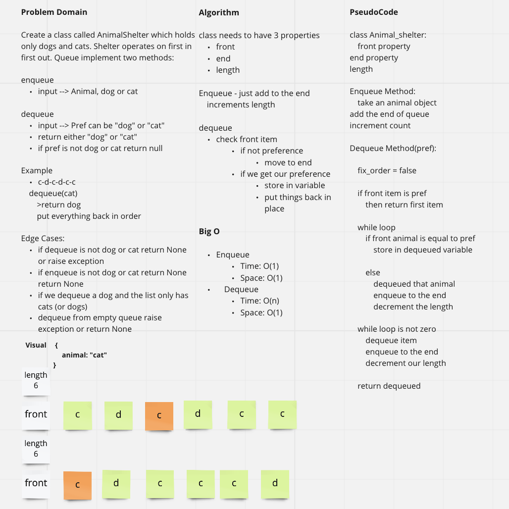

# Animal Shelter Queue
<!-- Description of the challenge -->
An animal shelter holds only dogs and cats, and operates on a strictly "first in, first out" basis.

## Links

- [See Code](animal_shelter.py)
- [See Tests](../tests/test_animal_shelter.py)

## Feature Tasks

Create a class called AnimalShelter which holds only dogs and cats.
The shelter operates using a first-in, first-out approach.

- Implement the following methods:

  - enqueue

    - Arguments: animal

      - `animal` can be either a dog or a cat object.

  - dequeue

    - Arguments: pref

      - `pref` can be either `"dog"` or `"cat"`

    - Return: either a dog or a cat, based on preference.

      - If `pref` is not `"dog"` or `"cat"` then return null.

## Whiteboard Process
<!-- Embedded whiteboard image -->

## Approach & Efficiency
<!-- What approach did you take? Why? What is the Big O space/time for this approach? -->
Big O:

Enqueue

- Time: O(1)
- Space: O(1)

Dequeue

- Time: O(n)
- Space: O(1)

## Collaborations
<!-- Show how to run your code, and examples of it in action -->
