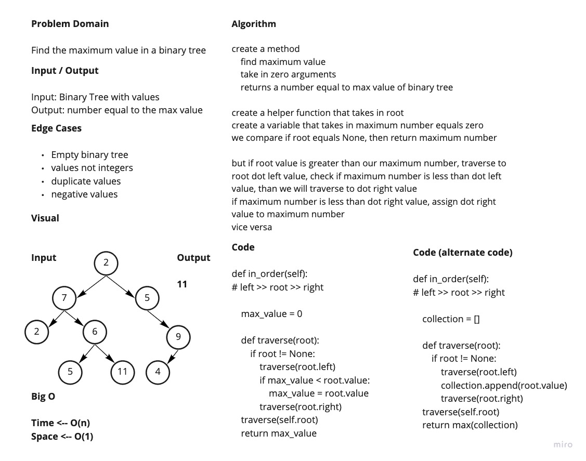

# Trees
<!-- Short summary or background information -->
Tree traversals using depth first:

- Pre-order: ```root >> left >> right```
- In-order: ```left >> root >> right```
- Post-order: ```left >> right >> root```

## Challenge
<!-- Description of the challenge -->

Node

  - Create a Node class that has properties for the value stored in the node, the left child node, and the right child node.

Binary Tree

  - Create a Binary Tree class
    - Define a method for each of the depth first traversals:
      - pre order
      - in order
      - post order which returns an array of the values, ordered appropriately.

  - Any exceptions or errors that come from your code should be semantic, capture-able errors. For example, rather than a default error thrown by your language, your code should raise/throw a custom, semantic error that describes what went wrong in calling the methods you wrote for this lab.

Binary Search Tree

  - Create a Binary Search Tree class
    - This class should be a sub-class (or your languages equivalent) of the Binary Tree Class, with the following additional methods:
    - Add
      - Arguments: value
      - Return: nothing
      - Adds a new node with that value in the correct location in the binary search tree.

    - Contains
      - Argument: value
      - Returns: boolean indicating whether or not the value is in the tree at least once.

## Whitebaord
<!-- What approach did you take? Why? What is the Big O space/time for this approach? -->


## Credit & Collaborations
<!-- Description of each method publicly available in each of your trees -->
Worked on Code Challenge with Davee, Prabin, Wondwosen.
