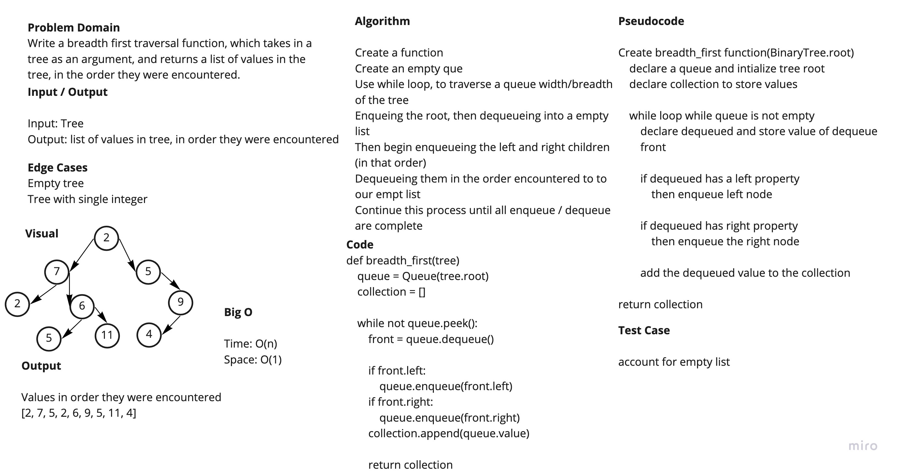

# Breadth-First Traversal

Given a tree, return a list of all values in the tree, in the order they were encountered

## Links

[Code](breadth_first.py)
[Test](tests/test_breadth_first.py)

## Whiteboard Process

## Approach and Efficiency

Breadth first traversal uses a queue to keep track of the nodes. We initialize our queue with the root of the tree. Then start a while loop while the queue is not empty. We will dequeue, then enqueue that dequeued items left and right property. Then push the value into a result list. Then return that result list.

## Credits and Collaborations

[Prabin Singh](https://github.com/prabin544), [Davee Sok](https://github.com/daveeS987), [Wondwosen](https://github.com/WondwosenTsige), [Michael Ryan](https://github.com/Michaelryan228)
