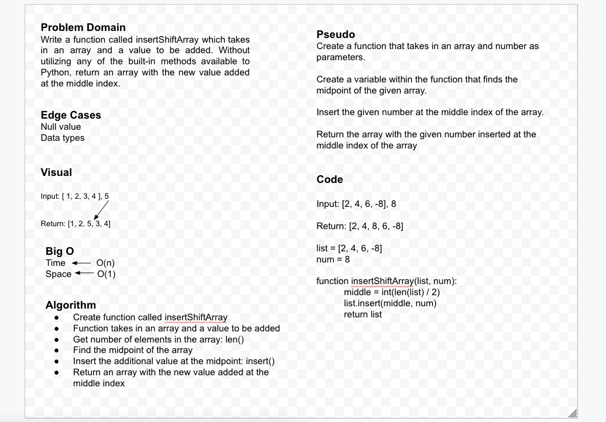

# Insert to Middle of an Array
<!-- Description of the challenge -->
Write a function called insertShiftArray which takes in an array and a value to be added. Without utilizing any of the built-in methods available to your language, return an array with the new value added at the middle index.

## Whiteboard Process
<!-- Embedded whiteboard image -->

## Approach & Efficiency
<!-- What approach did you take? Discuss Why. What is the Big O space/time for this approach? -->
The solution to our code challenge was found using two sources:
    - [How to find midpoint of list](https://discuss.codecademy.com/t/how-can-i-get-the-index-of-the-middle-element/377349)

    - [Python List insert() documentation](https://www.programiz.com/python-programming/methods/list/insert)

### Collaboration & Credit

This assignment I pair programmed with Marie Marcos, and received assistance from TA Anthony.
