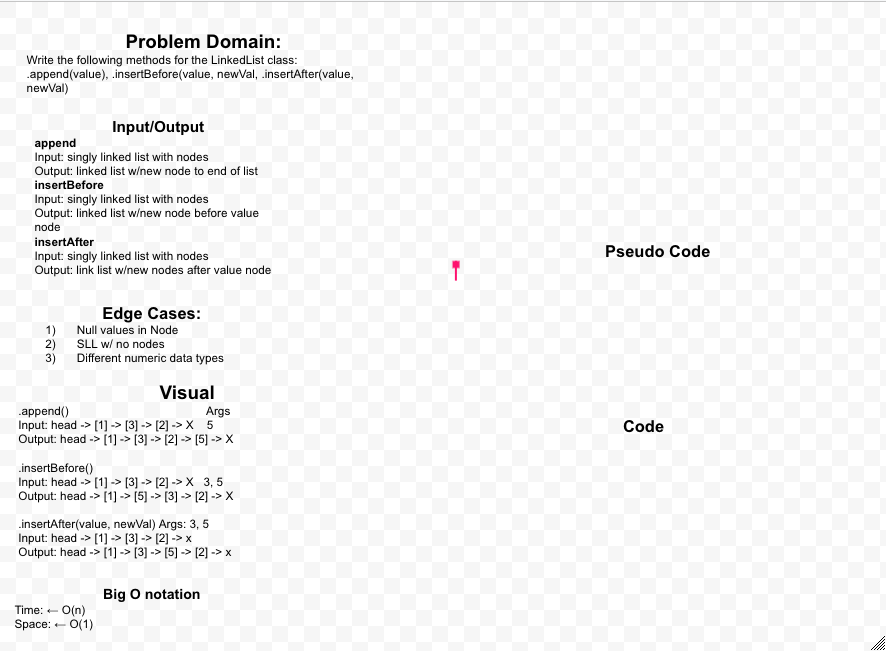

# Code Challenge 05: Singly Linked List
<!-- Short summary or background information -->
Implementation: Singly Linked Lists

## Challenge_05
<!-- Description of the challenge -->
- Create a Node class that has properties for the value stored in the Node, and a pointer to the next Node.
- Within your LinkedList class, include a head property. Upon instantiation, an empty Linked List should be created.
- Define a method called insert which takes any value as an argument and adds a new node with that value to the head of the list with an O(1) Time performance.
- Define a method called includes which takes any value as an argument and returns a boolean result depending on whether that value exists as a Node’s value somewhere within the list.
- Define a method called toString (or __str__ in Python) which takes in no arguments and returns a string representing all the values in the Linked List, formatted as:
"{ a } -> { b } -> { c } -> NULL"
- Any exceptions or errors that come from your code should be semantic, capturable errors. For example, rather than a default error thrown by your language, your code should raise/throw a custom, semantic error that describes what went wrong in calling the methods you wrote for this lab.

## Approach & Efficiency_05
<!-- What approach did you take? Why? What is the Big O space/time for this approach? -->

## Collaborations & Credit_05

I worked on the Code Challenge with Davee Sok and Michael Ryan.

## Code Challenge 06
<!-- Short summary or background information -->
Extend a Linked List to allow various insertion methods.

## Challenge_06
<!-- Description of the challenge -->
- .append(value) which adds a new node with the given value to the end of the list
- .insertBefore(value, newVal) which add a new node with the given newValue immediately before the first value node
- .insertAfter(value, newVal) which add a new node with the given newValue immediately after the first value node

## Whiteboard Process
<!-- Embedded whiteboard image -->

## Approach & Efficiency_06
<!-- What approach did you take? Discuss Why. What is the Big O space/time for this approach? -->

## Collaborations & Credit_06

My pair programming partner was Tony Regalado.
Assistance from TA Anthony

## Code Challenge 07
<!-- Short summary or background information -->
Extending an Implementation

## Challenge_07
<!-- Description of the challenge -->
- kth from end
argument: a number, k, as a parameter.
- Return the node’s value that is k places from the tail of the linked list.
- You have access to the Node class and all the properties on the Linked List class as well as the methods created in previous challenges.

## Collaborations & Credit_07

This lab was done with our Game of Greed group: Kassie Bradshaw, Daniel Dills, Michael Ryan, Matt Santorsola
