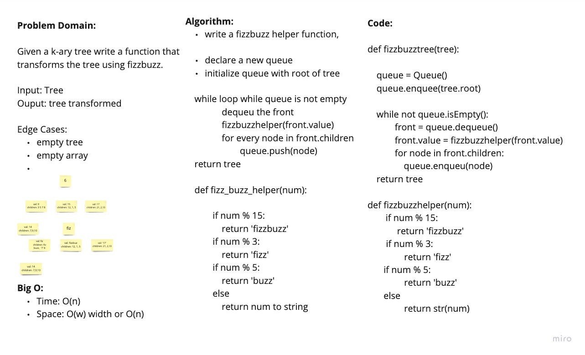

# Code Challenge 18: FizzBuzz

Conduct “FizzBuzz” on a k-ary tree while traversing through it to create a new tree.

Set the values of each of the new nodes depending on the corresponding node value in the source tree.

## White Board Process

## Credit & Collaborations

[Prabin Singh](https://github.com/prabin544), [Davee Sok](https://github.com/daveeS987), [Wondwosen](https://github.com/WondwosenTsige), [Michael Ryan](https://github.com/Michaelryan228)
