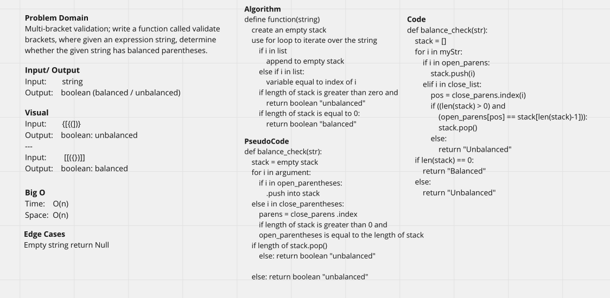

# Multi-bracket Validation

## Links

- [See Code](brackets.py)
- [See Tests](../tests/test_brackets.py)

## Feature Tasks

- [x]Read all of these instructions carefully.
- [x]Name things exactly as described.
- [x]Do all your work in a your data-structures-and-algorithms public repository.
- [x]Create a new branch in your repo named as noted below.
- [x]Follow the language-specific instructions for the challenge type listed below.
- [x]Update the “Table of Contents” - in the README at the root of the repository - with a link to this challenge’s README file.

## Whiteboard Process

## Approach & Efficiency

Big O:

Time: O(n)
Space: O(n)

### Citation

[Check for balanced parentheses in Python](https://www.geeksforgeeks.org/check-for-balanced-parentheses-in-python/)
