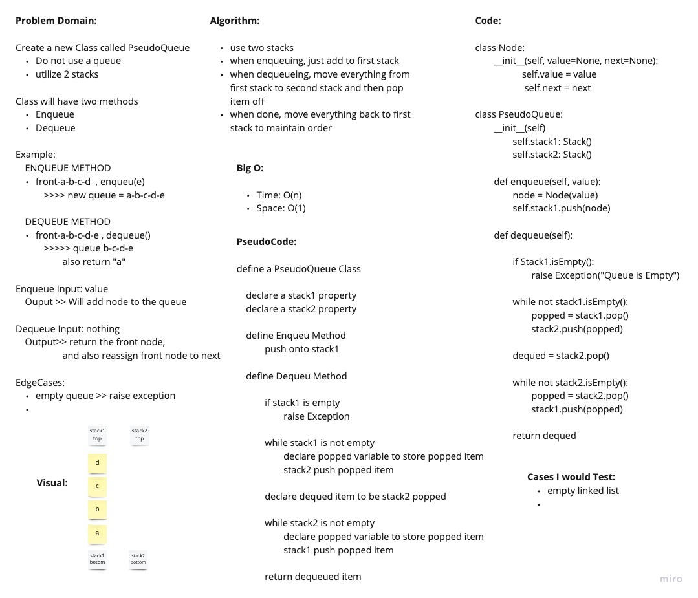

# Challenge Summary
<!-- Description of the challenge -->
Implement a Queue using two Stacks

## Links

- [Code](stack_queue_pseudo.py)
- [Test](../tests/test_stack_queue_pseudo.py)

## Whiteboard Process
<!-- Embedded whiteboard image -->

## Approach & Efficiency
<!-- What approach did you take? Why? What is the Big O space/time for this approach? -->
Big O:

  - Time: O(n)
  - Space: O(1)

## Collaborators
<!-- List all collaborators and credits -->
Davee Sok, Prabin Singh, Wondwosen
